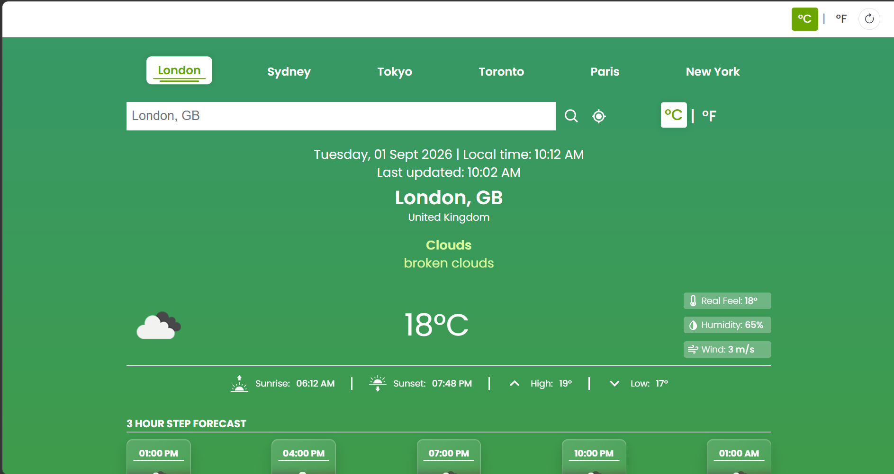
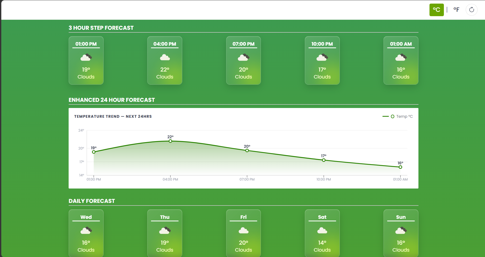
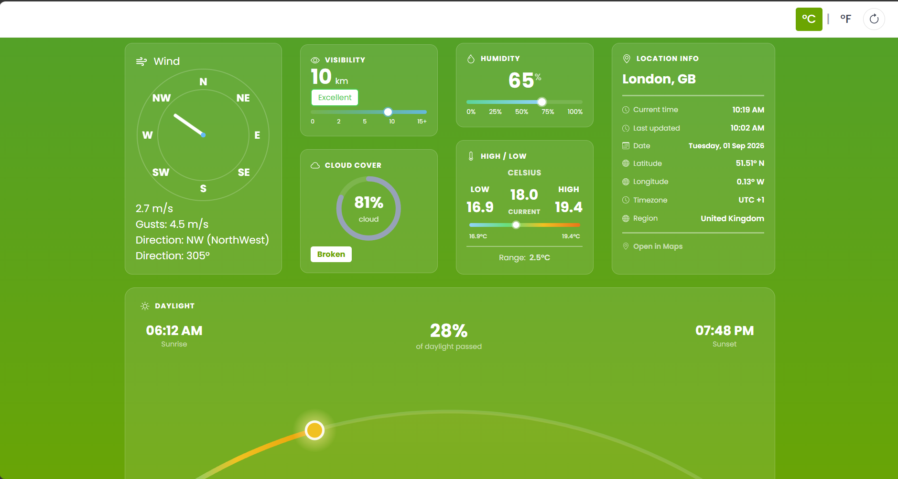
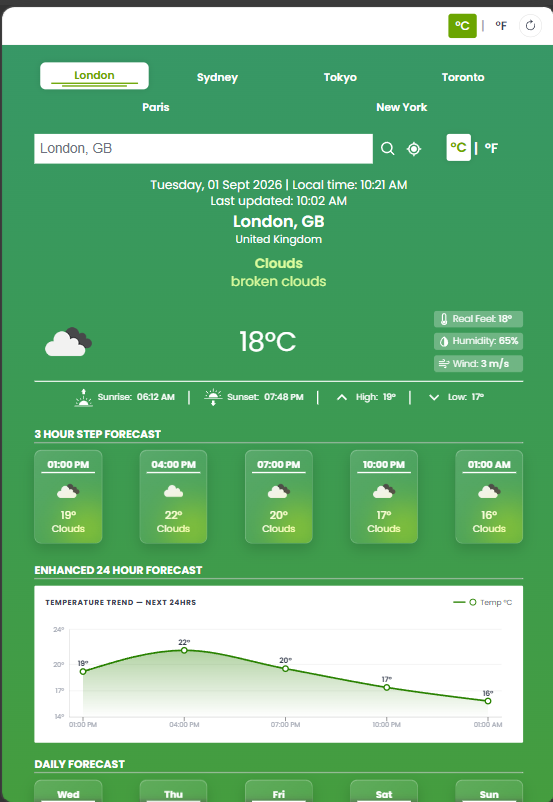
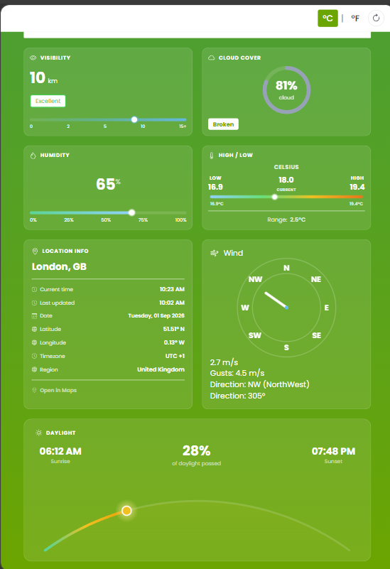
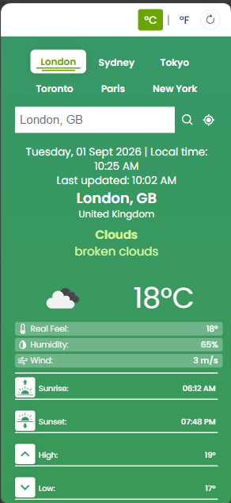
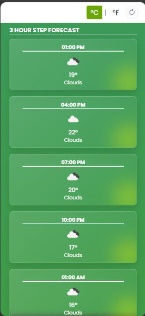
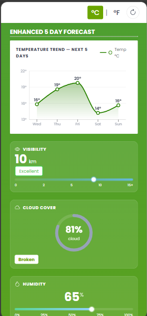
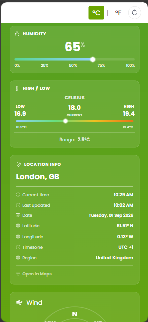
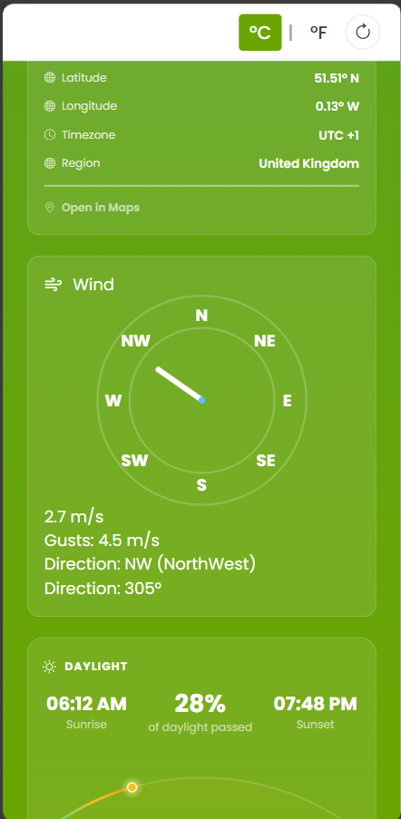

# React Weather App

A responsive weather application built with React. The project integrates the OpenWeather API to fetch and display current weather conditions, forecasts, wind information, and location data while focusing on clean presentation, responsive design, and interactive UI.

The application allows users to search for locations, search for their current location, switch between metric and imperial units, and quickly access predefined cities. Weather information is presented through a collection of responsive components, including a dynamic wind compass, a daylight indicator, a humidity gauge, a cloud Coverage progress ring detailed weather information, and forecast cards.

The project is designed as both a functional application and a case study, with an emphasis on reusable React components, responsive layouts, API integration, state management, and practical frontend development.

## Preview

### Desktop





### Tablet




### Mobile







---

## Features

* Search for locations using the search bar
* Current location detection using the browser Geolocation API
* Predefined location shortcuts for commonly searched cities
* Celsius and Fahrenheit unit conversion
* Humidity, visibility and cloud coverage information
* Wind speed, gusts and direction information
* Accurate wind direction compass
* Hourly and daily weather forecasts
* Dynamic weather themed backgrounds
* Responsive layouts across desktop, tablet and mobile
* Responsive forecast cards and weather detail sections
* Automatic location information using country codes returned by the API

## Tech Stack

* React
* Vite
* JavaScript
* CSS
* OpenWeather REST API
* React Icons
* Browser Geolocation API
* Recharts

## Motivation

I built this project as a way to deepen my understanding of working with real world APIs in React while developing a complete frontend application.

Rather than simply displaying API data, I wanted to explore how weather information could be presented through a clean and intuitive interface. This included designing components for different categories of weather information, creating a visual wind compass, and providing different ways for users to search for locations.

A major focus of the project was responsive design. The application was designed to remain usable across a range of screen sizes, and rather than simply scaling down the desktop layout the layout does shift to accommodate the the lack of available space. This involved using Flexbox, CSS media queries, responsive sizing, and restructuring individual sections at different breakpoints.

The project gave me an opportunity to work with asynchronous API data, browser geolocation, React state management, unit conversion, and a dynamic CSS based visual presentation system that reacts to weather conditions.

## Getting Started

### 1. Clone the repository

```bash
git clone 

cd weather-app
```

### 2. Install dependencies

```bash
npm install
```

### 3. Set up environment variables

Get an API key from OpenWeather.

Create a .env file in the project root:
```bash
VITE_WEATHER_API_KEY=api_key
```

### 4. Run the development server

```bash
npm run dev
```
## How It Works 

### Fetching Weather Data
Weather information is retrieved from the OpenWeather API based on the location supplied by the user.

The application supports both location-name queries and latitude/longitude queries:


```js
setQuery({ q: city });
```

For the current location feature, the browser's Geolocation API provides the user's coordinates:

```js
navigator.geolocation.getCurrentPosition((position) => {
    const { latitude, longitude } = position.coords;

    setQuery({
        lat: latitude,
        lon: longitude
    });
});
```

The resulting weather data is then passed to the relevant React components for display.

### Location Search

Users can search for locations through the search bar, use a dedicated button for searching the user's current location or select one of the predefined locations displayed above it.

The search bar is also updated when a location is selected through another method, keeping the displayed location consistent with the weather information currently being shown.

### Current Location

The application uses the browser's Geolocation API to obtain the user's latitude and longitude.

These coordinates are passed to the OpenWeather API, allowing the application to retrieve weather conditions for the user's current location.

The location name and country code returned by the API are then used to update the location displayed in the search bar.

### Unit Conversion

Temperature and wind speed are converted depending on the selected unit system. By default the project uses the metric values and does conversion of values client side when the user switches to imperial units.

Conversion is handled through dedicated utility functions:

```js
convertTemp(temp, units)
```

Wind speed conversion is handled separately:
```js
convertWind(ms, units)
```
Both functions take the original response data and conditionally convert it if the units are set to imperial, if not the original value is returned unchanged:

```js
export const convertTemp = (c, units) => {
    return units === 'imperial' ? toF(c) : c;
};
```
Keeping the conversion logic separate from the API requests allows for the reduction of unnecessary API calls, whilst still supporting both metric and imperial units.

### Wind Compass

The wind section includes a visual compass that represents the current wind direction.

The compass uses the wind direction supplied by the API in degrees:

```js
transform: `translateX(-50%) translateY(-100%) rotate(${deg}deg)`
```

The numerical degree value is also converted into one of eight cardinal or intercardinal directions:

```js
N
NE
E
SE
S
SW
W
NW
```

The compass is built using CSS positioning and responsive sizing, allowing it to adapt to the available space within its container.

### Weather Data Visualisations

Several weather conditions are represented visually rather than solely through numerical values.

The web application includes:

* A a visual arc based daylight indicator for sunrise and sunset information
* A humidity gauge for displaying humidity levels
* A cloud coverage progress ring
* A wind compass for displaying wind direction
* Temperature trend charts using Recharts

These components provide visual representations of the API data while keeping the underlying values available to the user.

### Dynamic Weather Styling

The application's visual presentation changes depending on the current weather conditions.

Different weather ranges are assigned their own CSS classes, which control the background gradients of the main outer container:

```css
.cool-bg {
    background-image: linear-gradient(#0891b2, #3b82f6);
}

.mild-bg {
    background-image: linear-gradient(#059669, #65a30d);
}

.warm-bg {
    background-image: linear-gradient(#ca8a04, #c2410c);
}
```

many other visual elements within the web application use this sytem to match the current weather theme:

```css
.cool-bg .CloudCoverage-badge{
  color: #3b82f6;
}
.mild-bg .CloudCoverage-badge {
  color: #65a30d;
}
.warm-bg .CloudCoverage-badge { 
  color: #c2410c; 
}
```

### Responsive Design

Responsive design was a major focus of the project.

Rather than simply scaling the desktop layout down, individual sections would at certain boudaries change their structure to accommodate the available space.

Flexbox and CSS media queries are used throughout the application to control how components behave at different breakpoints.

For example, the weather details change from a multi-column layout on larger screens to a two-column layout and eventually a single-column layout on smaller screens.

The forecast cards similarly adapt to the available space:

```css
@media (max-width: 700px) {
    .Forecast {
        flex-basis: calc(50% - 16px);
    }
}

@media (max-width: 450px) {
    .Forecast {
        flex-basis: 100%;
    }
}
```

Individual sections such as the top buttons, weather details, horizontal weather information and forecasts have their own responsive layout behaviour.

## Project Structure

The application is divided into reusable React components, services, and utility functions, with individual components responsible for displaying different types of weather information.

The main components include:

```Markdown
src/
├── components/
│   ├── CloudCoverage
│   ├── Daylight
│   ├── Forecast
│   ├── HighLow
│   ├── Humidity
│   ├── Inputs
│   ├── LocationInfo
│   ├── Navbar
│   ├── TemperatureAndDetails
│   ├── TimeAndLocation
│   ├── TopButtons
│   ├── TrendChart
│   ├── Visibility
│   └── WindCompass
│
├── services/
│   └── weatherService.js
│
├── utils/
│   └── convertUnits.js
│
├── App.jsx
├── index.css
├── index.js
├── main.jsx
└── style.css
```
### Components

Each component is responsible for a specific section of the weather interface. Most components have their own CSS file to keep styling isolated from unrelated sections.

### Services

The `services` directory contains the application's API-related logic. `weatherService.js` handles communication with the OpenWeather API.

### Utilities

The `utils` directory contains reusable helper functions. `convertUnits.js` handles temperature and wind-speed conversion between metric and imperial units.

### Application Entry

`App.jsx` manages the main application structure and shared weather state, while `main.jsx` provides the React application entry point.

This structure keeps the application's different sections separated while allowing App.jsx to manage the weather data and state shared between components.

## Customisation
### Modify Predefined Locations

The locations displayed by the top buttons are prewritten as data objects, and can be modified inside the TopButtons component.

For example:

```js
const cities = [
    {
        id: 1,
        title: "London",
        country: "GB"
    },
    {
        id: 2,
        title: "Sydney",
        country: "AU"
    }
];
```

### Modify Weather Styling

Weather-specific backgrounds can be adjusted through the CSS classes associated with each weather state:

```css
.cool-bg
.mild-bg
.warm-bg
```

The styling of individual weather cards and visualisations can also be modified within their respective component CSS files.

### Support

If you found this useful or interesting, consider giving the repo a star!

## License

This project is open-source and available under the MIT License.

## Attribution

This project uses the OpenWeather API to retrieve weather information.

Weather data is provided by OpenWeather and is subject to their API terms and conditions.

This project is a non-commercial portfolio piece intended to demonstrate frontend development practices and does not claim ownership of the underlying weather data.

## Inspiration

This project was inspired by the following YouTube tutorial:

* **[Build A Weather App With React JS | Hourly And Daily Forecast | 2024](https://www.youtube.com/watch?v=SAE_TN2mD3Q&t=2700s)** — by Yash Patel


The tutorial provided the initial inspiration and foundation for exploring weather API integration with React. The project was subsequently developed and significantly customised, including the UI design, responsive layouts, weather visualisations, wind compass, unit conversion system, component structure, and additional functionality.

This project is a personal portfolio project and is not affiliated with or endorsed by the tutorial creator.